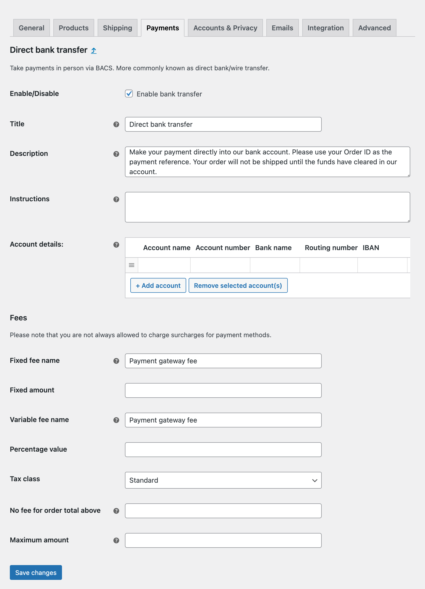

<p align="center"></p>

# Pronamic Payment Gateways Fees for WooCommerce

This WordPress plugin adds settings to all WooCommerce gateways to add a fixed and/or variable (percentage) fee.

[](https://packagist.org/packages/pronamic/pronamic-payment-gateways-fees-for-woocommerce)
[](https://packagist.org/packages/pronamic/pronamic-payment-gateways-fees-for-woocommerce)
[](https://packagist.org/packages/pronamic/pronamic-payment-gateways-fees-for-woocommerce)
[](https://packagist.org/packages/pronamic/pronamic-payment-gateways-fees-for-woocommerce)
[](https://packagist.org/packages/pronamic/pronamic-payment-gateways-fees-for-woocommerce)

- [Introduction](#introduction)
- [Installation](#installation)
- [Screenshots](#screenshots)
- [Flow](#flow)
- [Links](#links)

## Introduction

This WordPress plugin adds settings to all WooCommerce gateways to add a fixed and/or variable (percentage) fee.

## Installation

```
composer require pronamic/pronamic-payment-gateways-fees-for-woocommerce
```

```php
\Pronamic\WooCommercePaymentGatewaysFees\Plugin::instance()->setup();
```

## Screenshots



## Flow

WooCommerce recommends using the `woocommerce_cart_calculate_fees` hook to add fees:

>  We suggest using the action woocommerce_cart_calculate_fees hook for adding fees.

_Source: https://github.com/woocommerce/woocommerce/blob/8.1.0/plugins/woocommerce/includes/class-wc-cart-fees.php#L7_

This hook is called as soon as the `WC()->cart->calculate_totals()` function is called, WooCommerce uses the `WC_Cart_Totals` class to calculate totals:

**`class-wc-cart.php`**

```php
/**
 * Calculate totals for the items in the cart.
 *
 * @uses WC_Cart_Totals
 */
public function calculate_totals() {
	$this->reset_totals();

	if ( $this->is_empty() ) {
		$this->session->set_session();
		return;
	}

	do_action( 'woocommerce_before_calculate_totals', $this );

	new WC_Cart_Totals( $this );

	do_action( 'woocommerce_after_calculate_totals', $this );
}
```

_Source: https://github.com/woocommerce/woocommerce/blob/8.1.0/plugins/woocommerce/includes/class-wc-cart.php#L1393-L1411_

When creating a `WC_Cart_Totals` instance, the `WC_Cart_Totals->calculate()` function is executed:

**`class-wc-cart-totals.php`**

```php
/**
 * Run all calculation methods on the given items in sequence.
 *
 * @since 3.2.0
 */
protected function calculate() {
	$this->calculate_item_totals();
	$this->calculate_shipping_totals();
	$this->calculate_fee_totals();
	$this->calculate_totals();
}
```

_Source: https://github.com/woocommerce/woocommerce/blob/8.1.0/plugins/woocommerce/includes/class-wc-cart-totals.php#L127-L154_

What can be seen here is that the final totals are calculated after calculating the fee totals. This means that the order total is not yet available within the `woocommerce_cart_calculate_fees` hook. In other words, within the `woocommerce_cart_calculate_fees` hook the result of `$cart->get_total( '' )` will always be `0`.

This is inconvenient because the payment gateway fees are often based on the total amount to be paid. That's why we hook into the `woocommerce_after_calculate_totals` hook and recalculate the totals again. This extra calculation seems double, but it seems to be the easiest way to reliably request the cart total.

## Links

- https://www.pronamic.eu/

[](https://www.pronamic.eu/contact/)
